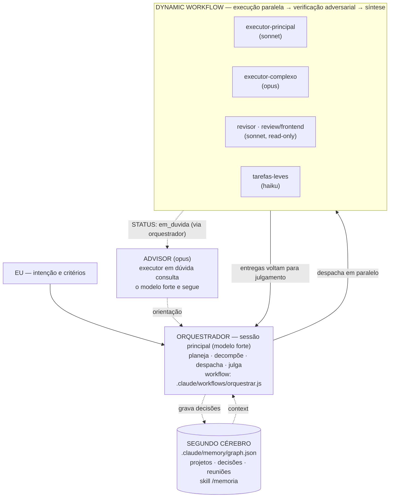

# Arquitetura de agentes — Agentes orquestrando agentes

Fluxo de desenvolvimento com IA do projeto Vision, para uso local com Claude
Code. Três padrões: **(1) orquestrador + executores**, **(2) advisor**,
**(3) memória em grafo**. Lema: *o modelo caro pensa, os baratos executam* —
não é trade-off, é qualidade ↑ e custo ↓ ao mesmo tempo.



## 1. Orquestrador + executores

O **orquestrador é a sessão principal do Claude Code** (o modelo forte que
você está rodando) — não é um subagente. Ele recebe sua intenção e critérios,
e para tarefas multi-parte invoca o workflow `orquestrar`
(`.claude/workflows/orquestrar.js`), que roda 4 fases:

1. **Planejamento** — consulta o segundo cérebro e decompõe a tarefa em 1–5
   subtarefas independentes, classificadas por complexidade.
2. **Execução paralela** — cada subtarefa vai ao executor certo:

   | Complexidade | Agente (`.claude/agents/`) | Modelo | Uso |
   |---|---|---|---|
   | leve | `tarefas-leves` | haiku | renomes, i18n, docs, boilerplate |
   | padrao | `executor-principal` | sonnet | features/refactors de escopo claro |
   | complexa | `executor-complexo` | opus | motor financeiro, algoritmos, multi-arquivo |

3. **Verificação adversarial** — o `revisor` (sonnet, read-only) tenta
   derrubar as entregas: Regra Zero, APIs antigas do Next 16, tipos frouxos,
   a11y, testes ausentes. Reprovou → 1 rodada de correção.
4. **Síntese** — julgamento final: o que foi feito, estado da verificação,
   pendências e decisões novas propostas para a memória.

Invocação: skill `/orquestrar`, ou diretamente o tool Workflow com
`{ name: "orquestrar", args: "<tarefa> Critérios de aceite: <critérios>" }`.
Tarefa única e pequena não precisa do workflow — despache o subagente certo
direto.

## 2. Advisor

Executor em dúvida **não chuta**: retorna `STATUS: em_duvida` com a pergunta
(`DUVIDA`). Como subagente não spawna subagente, o loop é mediado pelo
orquestrador: ele despacha o `advisor` (opus, read-only), recebe
`ORIENTACAO / JUSTIFICATIVA / RISCOS` e redespacha o executor com a
orientação anexada. **Máximo 1 rodada** por subtarefa — dúvida persistente
escala ao humano na síntese, nunca itera sozinha.

## 3. Segundo cérebro (memória em grafo)

Grafo local versionado no git — `.claude/memory/graph.json` — plugado nos
agentes via CLI (nunca editar o JSON à mão):

```
node .claude/skills/memoria/memoria.mjs <query|add-node|add-edge|vizinhos|resumo|validate> [opções]
```

- **Nós**: `{id, tipo: projeto|decisao|reuniao|nota, titulo, corpo, data, tags[]}`.
  Ids com prefixo do tipo: `proj-`, `dec-`, `reun-`, `nota-`.
- **Arestas**: `{de, para, relacao}` — vocabulário sugerido: `pertence_a`,
  `decidiu_sobre`, `substitui`, `referencia`, `resultou_de`. Decisão que
  reverte outra usa `substitui` (a antiga não é apagada).
- **Escrita**: somente a sessão principal grava (skill `/memoria`, modo
  gravar); executores paralelos apenas consultam — evita escrita concorrente.
- **Hook SessionStart** (`.claude/settings.json`) imprime o `resumo` do grafo
  no início de cada sessão.

Exemplos:

```bash
# consultar decisões sobre agentes
node .claude/skills/memoria/memoria.mjs query --texto "agentes" --tipo decisao

# gravar uma decisão e conectá-la ao projeto
node .claude/skills/memoria/memoria.mjs add-node --tipo decisao \
  --titulo "Adotar X para Y" --corpo "Contexto e consequências..." --tags arquitetura
node .claude/skills/memoria/memoria.mjs add-edge \
  --de dec-adotar-x-para-y --para proj-vision --relacao pertence_a

# explorar o entorno de um nó
node .claude/skills/memoria/memoria.mjs vizinhos --id proj-vision --profundidade 2
```

## Regra Zero (vale para todos os agentes)

A LLM nunca faz aritmética financeira. Todo número exibido vem do motor
(`engine/`, validado por `engine/validator.ts` — ver `docs/ENGINE_SPEC.md`
§10). Os prompts de todos os executores e do revisor codificam essa regra; o
revisor faz grep ativo por cálculos fora do motor.

## Roteiro de teste local

1. **Grafo**: `node .claude/skills/memoria/memoria.mjs validate` → exit 0.
2. **Skill de memória**: `/memoria` + "o que já decidimos sobre agentes?" →
   deve citar `dec-memoria-local` e `dec-arquitetura-agentes`.
3. **Subagentes**: "use o subagente tarefas-leves para listar os arquivos de
   engine/" → confirma parse do frontmatter e roteamento para haiku.
4. **Advisor**: dê ao `executor-principal` uma tarefa deliberadamente ambígua
   ("melhore a validação", sem dizer onde) → deve retornar `STATUS: em_duvida`.
5. **Workflow completo**: `/orquestrar` com uma tarefa pequena real (ex.:
   "adicionar uma chave i18n nova em messages/ com teste") → 4 fases no
   progresso, dispatch paralelo, revisão rodando tsc/lint.

## Limitações conhecidas

- Subagente não spawna subagente — todo advisor loop passa pelo orquestrador.
- O workflow limita advisor e correção a 1 rodada cada; o que sobrar vira
  pendência explícita na síntese.
- Escrita concorrente no grafo não é suportada (por design): gravação só na
  sessão principal, após a síntese.
- O JS do workflow roda em sandbox determinística (sem `Date.now()`,
  `Math.random()`, `fs`, `fetch`) — datas e leitura do grafo acontecem dentro
  dos prompts dos agentes, que têm Bash/Read.
